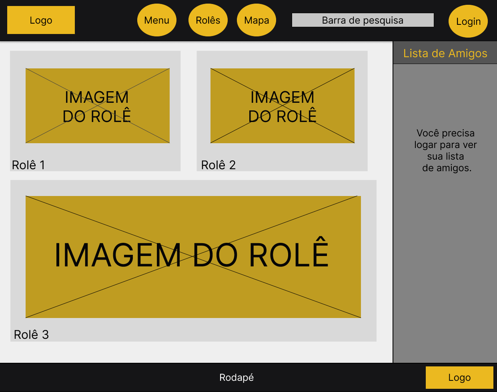
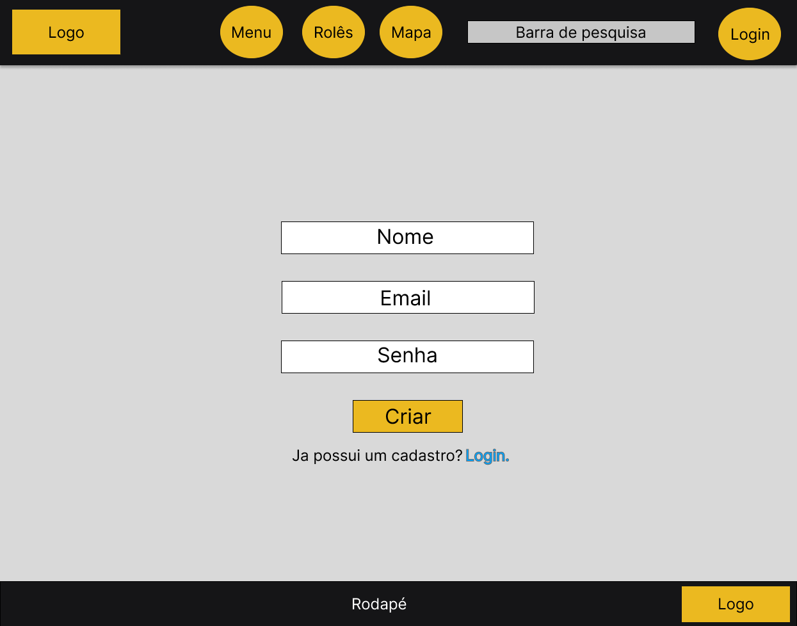
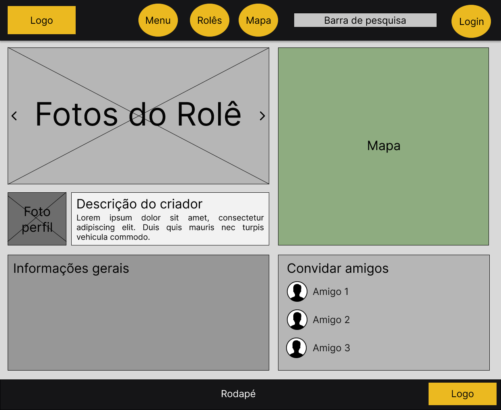
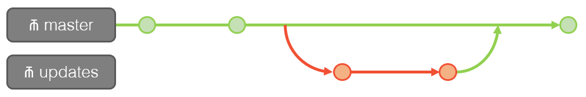

# :clipboard: Informações do Projeto
`Actual Rolê`

`Trabalho Interdisciplinar: Aplicações Web`

`Ciência da Computação`

## :construction_worker: Participantes

* André Luis de Oliveira Ferreira
* Eduardo Henrique Leite Cardoso
* Marcelo Victor Alencar Eulálio
* Nathan de Araújo Cunha Lisboa
* Pedro Malta Boscatti
* Rafael Cangussu Dallariva

# :wrench: Estrutura do Documento

- [Informações do Projeto](#informações-do-projeto)
  - [Participantes](#participantes)
- [Estrutura do Documento](#estrutura-do-documento)
- [Introdução](#introdução)
  - [Problema](#problema)
  - [Objetivos](#objetivos)
  - [Justificativa](#justificativa)
  - [Público-Alvo](#público-alvo)
- [Especificações do Projeto](#especificações-do-projeto)
  - [Personas e Mapas de Empatia](#personas-e-mapas-de-empatia)
  - [Histórias de Usuários](#histórias-de-usuários)
  - [Requisitos](#requisitos)
    - [Requisitos Funcionais](#requisitos-funcionais)
    - [Requisitos não Funcionais](#requisitos-não-funcionais)
  - [Restrições](#restrições)
- [Projeto de Interface](#projeto-de-interface)
  - [User Flow](#user-flow)
  - [Wireframes](#wireframes)
- [Metodologia](#metodologia)
  - [Divisão de Papéis](#divisão-de-papéis)
  - [Ferramentas](#ferramentas)
  - [Controle de Versão](#controle-de-versão)
- [**############## SPRINT 1 ACABA AQUI #############**](#-sprint-1-acaba-aqui-)
- [Projeto da Solução](#projeto-da-solução)
  - [Tecnologias Utilizadas](#tecnologias-utilizadas)
  - [Arquitetura da solução](#arquitetura-da-solução)
- [Avaliação da Aplicação](#avaliação-da-aplicação)
  - [Plano de Testes](#plano-de-testes)
  - [Ferramentas de Testes (Opcional)](#ferramentas-de-testes-opcional)
  - [Registros de Testes](#registros-de-testes)
- [Referências](#referências)

# :open_file_folder: Introdução

## Problema

Dia após dia a rotina das pessoas tem ficado cada vez mais corridas e, com isso, torna-se muito importante que tenham momentos de lazer para relaxar e tornar a vida menos estressante. Na atualidade, um dos exemplos para que ambos esses objetivos sejam atentidos com sucesso é as saídas, seja durante ou nos fins de semana, popularmente conhecidos como **rolês**.

Diante disso, encontram-se alguns obstáculos que todas as faixas etárias encontram. São eles: O que eu vou fazer? O que tem pra fazer? Com quem irei? Vou gastar algo? Como irei? Onde meus amigos estão? Estou sozinho, mas mesmo assim quero socializar. Como eu faço? São esses e muitas outros problemas que iremos tentar ajudar a resolver com a nossa aplicação, tornando bem mais fácil e dinâmico uma saída de casa, ou até mesmo um rolê na sua própria casa.

## Objetivos

O objetivo geral do grupo é desenvolver uma plataforma para facilitar as pessoas a encontrarem um rolê onde elas vão se sentir a vontade e aproveitar cada minuto. Também, a saber informações crucias sobre o rolê (pessoas confirmadas, meio de transportes, preço, etc.), ter algumas interações em tempo real e poder avaliar o rolê para que pessoas que estão pensando em ir saibam se vale a pena ou não comparecer.

## Justificativa

Essa plataforma vem para ajudar diversos tipos de pessoas a acharem um local ideal para se distrair. Com o final da pandemia, muitas pessoas ficaram isoladas e antissociais, assim, essa plataforma ajudaria essas pessoas a conseguirem socializar melhor.

É importante frisar que a ferramenta não quer atingir apenas esse público. Com as universidades voltando às aulas presenciais, todos querem sempre achar o melhor rolê. Sendo assim, é o momento ideal para socializar e ter sua hora de lazer e distração, tendo como facilitador o auxilio da plataforma.

## Público-Alvo

Com esse projeto, esperamos alcançar praticamente todas as pessoas interessadas em sair de casa e passar um tempo de qualidade com quem gostamos. Além de atingir uma variedade de donos de estabelecimento e divulgadores de evento.

Inicialmente, no entanto, o nosso foco são os jovens que querem arrumar um rolê ou divulgar um.

# :bookmark_tabs: Especificações do Projeto

Nessa seção, será apresentada uma visão um pouco mais aprofundada do projeto, através da elaboração das _Personas_, _Histórias de Usuários_, _Requisitos e Restrições do projeto_.

## Personas e Mapas de Empatia

* **Luiz Eduardo:** Luiz tem 19 anos e é estudante de Publicidade e Propaganda. Ele é uma pessoa muito extrovertida, animada e amigável, que tem como sonho ser um grande empresário e abrir um cassino. Ele usa o computador e o celular diariamente tanto para atividades de estudo como para o lazer. Ele quer saber quais são os rolês e como está a situação deles diariamente. Gosta de se sentir incluído e de ter pessoas animadas como companhias.

* **Lúcio Marcos:** Lúcio tem 26 anos e é advogado. Ele é uma pessoa bem humorada, simpática, tímida, calma e paciente. Adora ler e ver filmes nas horas vagas. Ele tem como sonho casar, ter filhos e morar perto do trabalho em um local boêmio. Usa o notebook para trabalhar e ver filmes, o celular para conversar com os amigos e a televisão para ver esportes. Ele quer saber onde os amigos estão para saber com antecedência se o lugar é tranquilo e tem o estilo musical que ele mais gosta. Deve ter os seus momentos de privacidade respeitados, mas sem deixar de incluí-lo nos rolês que são mais calmos e combinam com a sua personalidade.

* **Maria Clara:** Maria Clara tem 21 anos e é estudante de Marketing e influenciadora digital. Ela adora gravar videos de maquiagem e é uma pessoa sociável, engraçada, inteligente e responsável. Sonha em se formar na faculdade conseguindo conciliar com a vida de influenciadora. Usa o computador e o celular tanto para trabalhar quanto para se entreter e estudar. Ela tem interesse na plataforma pois quer promover eventos de grande escala e divulgá-los tendo o apoio necessário para conseguir atrair um público maior.

## Histórias de Usuários

Com base na análise das personas, foram identificadas as seguintes histórias de usuários:

|EU COMO... `PERSONA`| QUERO/PRECISO ... `FUNCIONALIDADE` |PARA ... `MOTIVO/VALOR`                 |
|--------------------|------------------------------------|----------------------------------------|
|Usuário do aplicativo | Achar um rolê animado          | Me divertir              |
|Usuário do aplicativo| Achar um rolê tranquilo | Encontrar meus amigos e me sentir confortável|
|Promotor de um rolê       | Divulgar meu evento               | Aumentar o alcançe e o público  |

## Requisitos

As tabelas que se seguem apresentam os requisitos _funcionais_ e _não funcionais_ que detalham o escopo do projeto.

### Requisitos Funcionais

|ID    | Descrição do Requisito  | Prioridade |
|------|-----------------------------------------|----|
|RF-001| Cadastro de usuário | ALTA | 
|RF-002| Interface do rolê com as devidas informações | ALTA |
|RF-003| Localização/Mapa em tempo real | BAIXA |
|RF-004| Lista de Amigos | ALTA |
|RF-005| Feed com os rolês em destaque  | ALTA |
|RF-006| Meios de locomoção  | MÉDIA |
|RF-007| Busca de rolês (Barra de Pesquisa) | ALTA |
|RF-008| Avaliação do rolê | ALTA |

### Requisitos Não Funcionais

|ID     | Descrição do Requisito  |Prioridade |
|-------|-------------------------|----|
|RNF-001| Um sistema de responsividade para diversos tamanhos de tela | MÉDIA | 
|RNF-002| Deve processar requisições do usuário em pouco tempo |  BAIXA | 
|RNF-003| A plataforma deverá ter uma interface intuitiva | ALTA | 
|RNF-004| O sistema necessita de boa executabilidade em qualquer plataforma | ALTA |
|RNF-005| Necessidade de atender às normas legais | MÉDIA | 

## Restrições

O projeto está restrito pelos itens apresentados na tabela a seguir:

|ID| Restrição                                             |
|--|-------------------------------------------------------|
|01| O projeto deverá ser entregue até o final do semestre |
|02| Não pode ser desenvolvido um módulo de backend        |
|03| O projeto tem que ser desenvolvido apenas nas seguintes linguagens: HTML, CSS e JavaScript |
|04| O projeto deve ser versionado utilizando o controle de versão Git |

# :art: Projeto de Interface

A interface principal do projeto irá exibir um resumo de todas as funcionalidades, com um feed dos rolês em destaque, uma lista de amigos para os usuários que fizerem o login e um menu de navegação. Os focos da interface serão a responsividade e a intuitividade de navegação pela plataforma por parte dos usuários.

## User Flow

......  INCLUA AQUI O DIAGRAMA COM O FLUXO DO USUÁRIO NA APLICAÇÃO ......

> Fluxo de usuário (User Flow) é uma técnica que permite ao desenvolvedor
> mapear todo fluxo de telas do site ou app. Essa técnica funciona
> para alinhar os caminhos e as possíveis ações que o usuário pode
> fazer junto com os membros de sua equipe.
>
> **Links Úteis**:
> - [User Flow: O Quê É e Como Fazer?](https://medium.com/7bits/fluxo-de-usu%C3%A1rio-user-flow-o-que-%C3%A9-como-fazer-79d965872534)
> - [User Flow vs Site Maps](http://designr.com.br/sitemap-e-user-flow-quais-as-diferencas-e-quando-usar-cada-um/)
> - [Top 25 User Flow Tools & Templates for Smooth](https://www.mockplus.com/blog/post/user-flow-tools)
>
> **Exemplo**:
> 
> 

## Wireframes

### Página Inicial

### Página Login

### Página Rolê

## Protótipo Interativo

O protótipo interativo desenvolvido no Figma pode ser visto clicando [aqui](https://www.figma.com/proto/KXxttrw4qgjAF1K7UaD9XQ/Prot%C3%B3tipo-Rol%C3%AA?node-id=11%3A79&scaling=min-zoom&page-id=0%3A1&starting-point-node-id=11%3A79&show-proto-sidebar=1).

# :pencil2: Metodologia

......  COLOQUE AQUI O SEU TEXTO ......

> Nesta parte do documento, você deve apresentar a metodologia 
> adotada pelo grupo, descrevendo o processo de trabalho baseado nas metodologias ágeis, 
> a divisão de papéis e tarefas, as ferramentas empregadas e como foi realizada a
> gestão de configuração do projeto via GitHub.
>
> Coloque detalhes sobre o processo de Design Thinking e a implementação do Framework Scrum seguido
> pelo grupo. O grupo poderá fazer uso de ferramentas on-line para acompanhar
> o andamento do projeto, a execução das tarefas e o status de desenvolvimento
> da solução.
> 
> **Links Úteis**:
> - [Tutorial Trello](https://trello.com/b/8AygzjUA/tutorial-trello)
> - [Gestão ágil de projetos com o Trello](https://www.youtube.com/watch?v=1o9BOMAKBRE)
> - [Gerência de projetos - Trello com Scrum](https://www.youtube.com/watch?v=DHLA8X_ujwo)
> - [Tutorial Slack](https://slack.com/intl/en-br/)

## Divisão de Papéis

Após algumas reuniões e conversas, o grupo decidiu dividir os membros e as funções da seguinte forma:

| Integrante  | Função              |
|-----------|-------------------------|
|André Luis | Função | 
|Eduardo Henrique | Função |
|Marcelo Victor | Função |
|Nathan Lisboa | Função |
|Pedro Malta | Função |
|Rafael Cangussu | Função |

## Ferramentas

Para as nossas reuniões, estamos utilizando o Discord e fazendo encontros semanais. Pretendemos utilizar o Trello para organizar o nosso cronograma e o Visual Studio Code para ser o nosso editor de códigos.

| Ambiente  | Plataforma              |Link de Acesso |
|-----------|-------------------------|---------------|
|Processo de Design Thinkgin  | Miro |  https://miro.com/app/board/uXjVPUre77E=/ | 
|Repositório de código | GitHub | https://github.com/ICEI-PUC-Minas-PPLCC-TI/tiaw-ppl-cc-m-20222-10-encontrar-pessoas-para-role-3 | 
|Protótipo Interativo | Figma | https://www.figma.com/proto/KXxttrw4qgjAF1K7UaD9XQ/Prot%C3%B3tipo-Rol%C3%AA?node-id=11%3A79&scaling=min-zoom&page-id=0%3A1&starting-point-node-id=11%3A79&show-proto-sidebar=1 | 

 
> As ferramentas empregadas no projeto são:
> 
> - Visual Studio Code.
> - Discord.
> - Figma.
> - Trello.
> 
> O Visual Studio Code foi escolhido porque ele possui uma integração com o
> Github e um visual agradável e interativo, além de plugins muito úteis.
> 
> O Discord foi escolhido por possuir uma interface amigável e agilizar os processos de comunicação.
>
> O Trello também foi escolhido por sua interface intuitiva e pela quantidade de recursos disponíveis para a nosssa organização.
> 
> Por fim, para criar os diagramas do site e o protótipo, escolhemos o Figma, pois
> ele possui uma quantidade ampla de recursos e possibilita o trabalho simultâneo na mesma página.

## Controle de Versão

O [Git](https://git-scm.com/) foi a ferramenta de controle de versão escolhido. Por ele nós vamos subir os arquivos para o repositório hospedado no [Github](https://github.com).

Inicialmente, estamos pensando em trabalhar com duas branchs, uma principal e uma secundária, de alterações, que seriam nomeadas da seguinte forma:

- `master`: versão estável já testada do software;
- `updates`: versões que estão ainda em análise, para aprovação;

Depois de testada e aprovada, a branch dos updates seria mergida com a branch main, de modo a garantir maior segurança e impedir uma sobreposição de versões não aprovadas pelo grupo.

Eventuais bugs poderão utilizar a tag `bugs`, para que sejam rapidamente identificados por todos os membros do grupo.

**Exemplo do grupo:**

# **############## SPRINT 1 ACABA AQUI #############**

# Projeto da Solução

......  COLOQUE AQUI O SEU TEXTO ......

## Tecnologias Utilizadas

......  COLOQUE AQUI O SEU TEXTO ......

> Descreva aqui qual(is) tecnologias você vai usar para resolver o seu
> problema, ou seja, implementar a sua solução. Liste todas as
> tecnologias envolvidas, linguagens a serem utilizadas, serviços web,
> frameworks, bibliotecas, IDEs de desenvolvimento, e ferramentas.
> Apresente também uma figura explicando como as tecnologias estão
> relacionadas ou como uma interação do usuário com o sistema vai ser
> conduzida, por onde ela passa até retornar uma resposta ao usuário.
> 
> Inclua os diagramas de User Flow, esboços criados pelo grupo
> (stoyboards), além dos protótipos de telas (wireframes). Descreva cada
> item textualmente comentando e complementando o que está apresentado
> nas imagens.

## Arquitetura da solução

......  COLOQUE AQUI O SEU TEXTO E O DIAGRAMA DE ARQUITETURA .......

> Inclua um diagrama da solução e descreva os módulos e as tecnologias
> que fazem parte da solução. Discorra sobre o diagrama.
> 
> **Exemplo do diagrama de Arquitetura**:
> 
> 

# Avaliação da Aplicação

......  COLOQUE AQUI O SEU TEXTO ......

> Apresente os cenários de testes utilizados na realização dos testes da
> sua aplicação. Escolha cenários de testes que demonstrem os requisitos
> sendo satisfeitos.

## Plano de Testes

......  COLOQUE AQUI O SEU TEXTO ......

> Enumere quais cenários de testes foram selecionados para teste. Neste
> tópico o grupo deve detalhar quais funcionalidades avaliadas, o grupo
> de usuários que foi escolhido para participar do teste e as
> ferramentas utilizadas.
> 
> **Links Úteis**:
> - [IBM - Criação e Geração de Planos de Teste](https://www.ibm.com/developerworks/br/local/rational/criacao_geracao_planos_testes_software/index.html)
> - [Práticas e Técnicas de Testes Ágeis](http://assiste.serpro.gov.br/serproagil/Apresenta/slides.pdf)
> -  [Teste de Software: Conceitos e tipos de testes](https://blog.onedaytesting.com.br/teste-de-software/)

## Ferramentas de Testes (Opcional)

......  COLOQUE AQUI O SEU TEXTO ......

> Comente sobre as ferramentas de testes utilizadas.
> 
> **Links Úteis**:
> - [Ferramentas de Test para Java Script](https://geekflare.com/javascript-unit-testing/)
> - [UX Tools](https://uxdesign.cc/ux-user-research-and-user-testing-tools-2d339d379dc7)

## Registros de Testes

......  COLOQUE AQUI O SEU TEXTO ......

> Discorra sobre os resultados do teste. Ressaltando pontos fortes e
> fracos identificados na solução. Comente como o grupo pretende atacar
> esses pontos nas próximas iterações. Apresente as falhas detectadas e
> as melhorias geradas a partir dos resultados obtidos nos testes.

# Referências

......  COLOQUE AQUI O SEU TEXTO ......

> Inclua todas as referências (livros, artigos, sites, etc) utilizados
> no desenvolvimento do trabalho.
> 
> **Links Úteis**:
> - [Formato ABNT](https://www.normastecnicas.com/abnt/trabalhos-academicos/referencias/)
> - [Referências Bibliográficas da ABNT](https://comunidade.rockcontent.com/referencia-bibliografica-abnt/)
